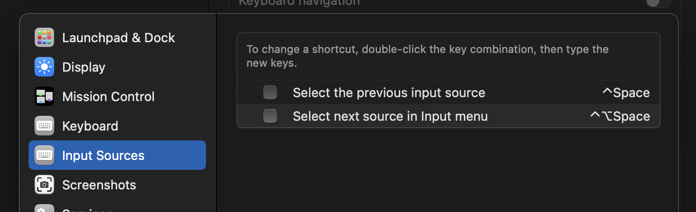

# sockfiles 🧦

My dotfiles. Mac OS based.

## Homebrew

I've included a dump of the tools/apps that I use within the `Brewfile`.

## Keyboard

Vim mode can be a pain with the default Mac keyboard. To make it much more pleasant I use [Karabiner Elements](https://karabiner-elements.pqrs.org/). My configuration for it is included within these dotfiles.

You can install it yourself via;

```bash
brew install karabiner-elements
```

Once you have it up and running open the configuration panel and make the following modifications;

- "Change caps_lock to left_control if pressed with other keys, change caps_lock to escape if pressed alone."

  You will need to import this from the website via the "Complex Modifications" section.

  This is the most important one. It has a dramatic impact on your Neovim/Vim experience and will save you from visiting a doctor with a warped pinky finger.

- "Change right_command+hjkl to arrow keys"

  This is by default bundles with Karabiner, you can add the rule via the "Complex Modifications" section.

  Also a great addition, no more need to try and find those annoying arrow keys and completely lose track of your finger placement.


## Mac OS Fixes

Make sure to disable the following settings so that `C-space` keyboard shortcuts work.



